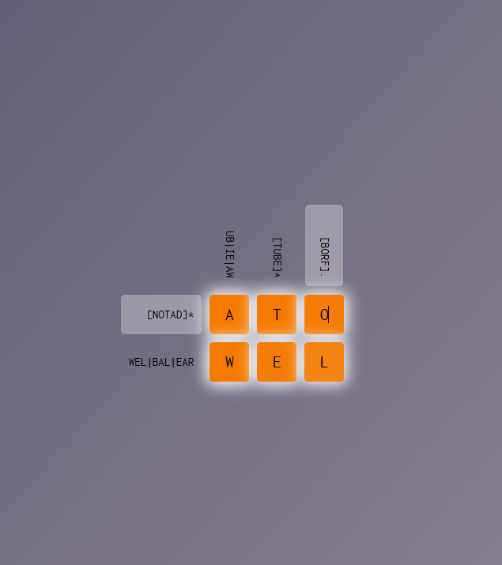
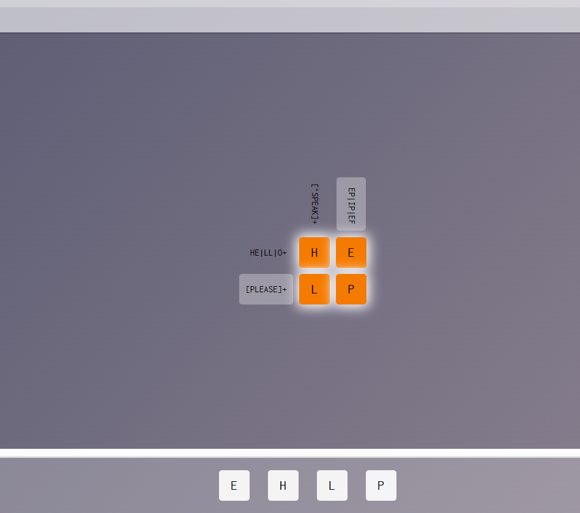
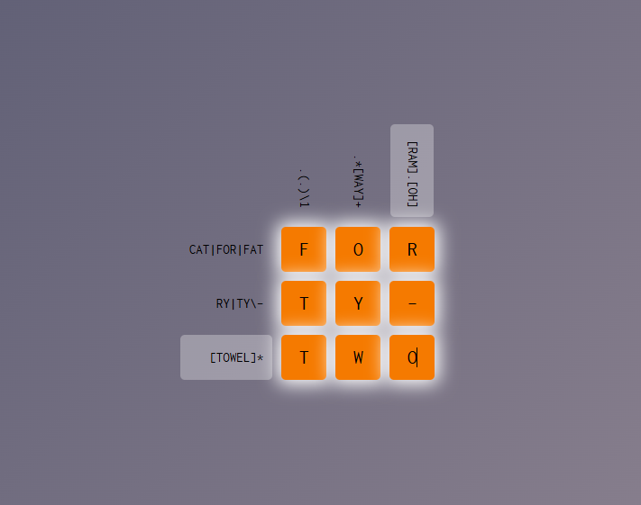
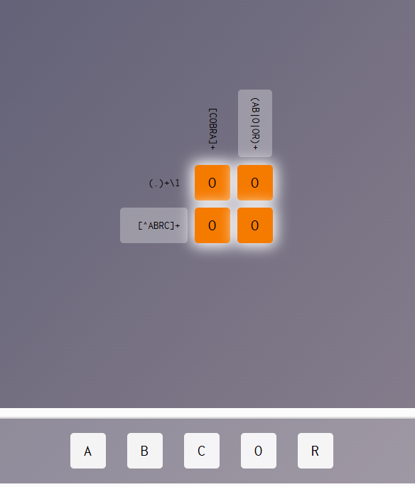
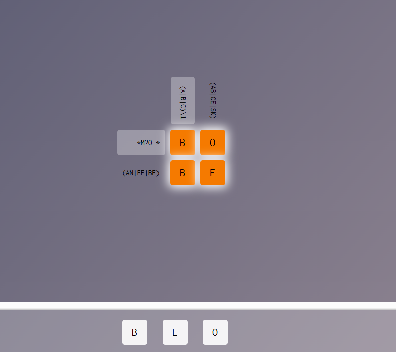
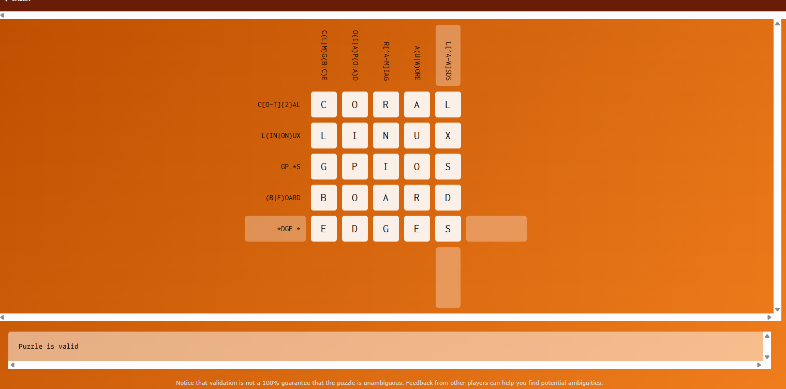

# Laboratório 01: Linguagens Regulares (Teoria da Computação)

Este repositório contém a solução do Laboratório 01, implementado em Scala 3 seguindo o paradigma funcional (com o uso estrito de valores imutáveis `val`, sem `var`).

## Estrutura do Projeto

* `src/main/scala/lab1/Automata.scala`: Definições das estruturas de NFAe, NFA e DFA.
* `src/main/scala/lab1/Converter.scala`: Algoritmos de conversão (eliminação de epsilon-transições e determinização via *Subset Construction*).
* `src/main/scala/lab1/Regex.scala`: Árvore Sintática (AST) para Expressões Regulares e um Parser combinador (`scala-parser-combinators`).
* `src/main/scala/lab1/Thompson.scala`: Algoritmo de conversão de AST de Regex para NFAe (*Thompson's Construction*).
* `src/main/scala/lab1/YamlIO.scala`: Manipulação de arquivos YAML para leitura e escrita dos autômatos, utilizando `circe`.
* `src/main/scala/lab1/Main.scala`: Ponto de entrada (CLI) da aplicação.
* `regex_crosswords/`: Diretório contendo as imagens com as resoluções dos desafios da Parte 3.

## Como Executar e Testar

Visando facilitar a avaliação e garantir a reprodutibilidade do ambiente sem a necessidade de instalar ferramentas (JDK, Scala 3, sbt) no sistema hospedeiro, foi disponibilizado um `Dockerfile`, bem como suporte ao Nix via `flake.nix` (conforme as instruções da disciplina).

### Opção 1: Via Docker (Recomendado)

Construa a imagem Docker do projeto a partir do diretório raiz:
```bash
docker build -t lab1-comp-theory .
```

Para executar a **Parte 1 (Conversão de Autômatos)**, processando um arquivo YAML:
* No Linux/macOS (Bash):
  ```bash
  docker run --rm -v $(pwd):/app lab1-comp-theory "run convert test.yaml test_dfa_out.yaml"
  ```
* No Windows (PowerShell):
  ```powershell
  docker run --rm -v ${PWD}:/app lab1-comp-theory "run convert test.yaml test_dfa_out.yaml"
  ```

Para executar a **Parte 2 (Regex para NFA-epsilon)**, passando a regex como parâmetro:
* No Linux/macOS (Bash):
  ```bash
  docker run --rm -v $(pwd):/app lab1-comp-theory "run regex \"a(a|b)*b\" thompson_out.yaml"
  ```
* No Windows (PowerShell):
  ```powershell
  docker run --rm -v ${PWD}:/app lab1-comp-theory 'run regex "a(a|b)*b" thompson_out.yaml'
  ```

*(Nota: O parâmetro `-v` mapeia o diretório atual para dentro do contêiner, permitindo que o programa grave os arquivos de saída, como `test_dfa_out.yaml` e `thompson_out.yaml`, diretamente na sua máquina local para inspeção).*

### Opção 2: Via Nix ou Instalação Local (sbt)

Para testar utilizando o arquivo `flake.nix` fornecido (se você tiver o Nix instalado), abra o shell de desenvolvimento que fará o download do JDK e do sbt automaticamente:

```bash
nix develop
```

Em seguida (ou caso já possua o `sbt` instalado na máquina), a execução pode ser feita diretamente no terminal:

```bash
sbt "run convert test.yaml test_dfa_out.yaml"
sbt "run regex \"a(a|b)*b\" thompson_out.yaml"
```

## Parte 3: Regex Crossword

Nesta etapa, foram resolvidos 5 desafios propostos na plataforma *Regex Crossword* e, adicionalmente, elaborado um quebra-cabeça original de 25 células (5x5).

### Desafios Resolvidos

Abaixo encontram-se as soluções dos desafios exigidos:

1. **Always Remember**



2. **Beatles:**



3. **Earth:**



4. **Ghost:**



5. **Naughty:**



### Quebra-Cabeça Autoral

O quebra-cabeça original, de nome "On the Edge", gerado para o trabalho obedece ao requisito mínimo de tamanho (grade 5x5) e engloba o uso combinado das regras fundamentais das expressões regulares (fecho de Kleene, união, repetição) a fim de demonstrar a complexidade requisitada.


